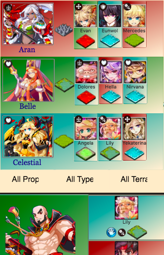

# [FwtHelper](https://fwt-helper.firebaseapp.com/)

## by [Adjectival](alexanderjacks.biz)

A personnel manager for heroes in the game 'Fantasy War Tactics R'. Build a team of heroes from the list of all available-- sort this list so you can build the ideal team for the battle, fast.

## [Live site](https://fwt-helper.firebaseapp.com/) :cloud::sparkles:
[Here is the app](https://fwt-helper.firebaseapp.com/), on Google Cloud Platform's Firebase hosting service.

### Features to implement :cyclone:
 - keep improving layout, make more responsive across tablet and desktop resolutions
 - inject New Relic performance monitoring tool
 - saving of pre-made parties
 - separate route for viewing created parties
 - saving favorite parties to user accounts
 - data service (perhaps basic API) to allow for Update / Create on heroes
 - authentication on WebFederated sites, to allow for user accounts

## Attribution

This project was generated with [Angular CLI](https://github.com/angular/angular-cli) version 1.3.2.

All intellectual property copyright respective owners.
